# Image Capture and Setup (clamp)

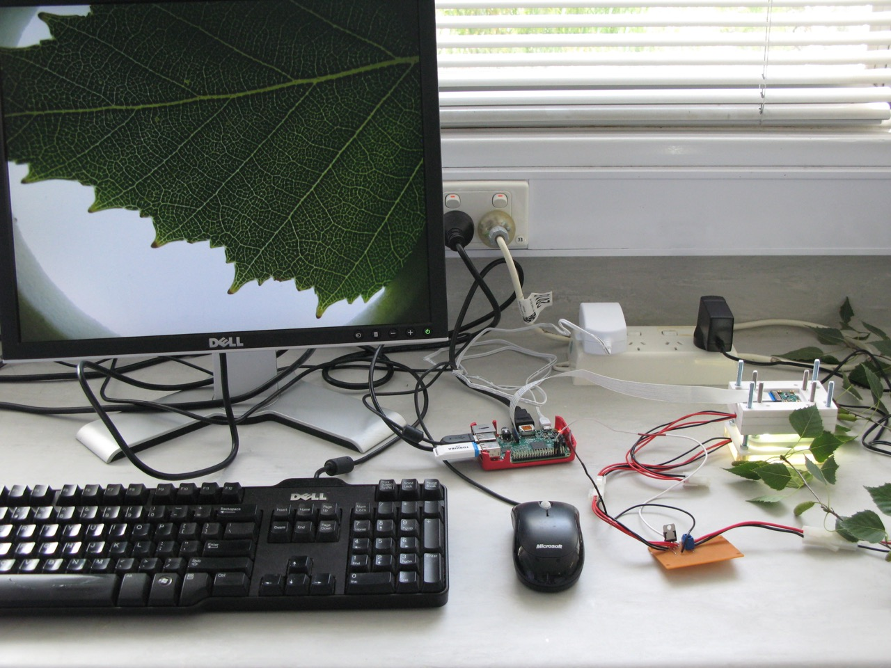

## Parts

Quantity | Part | Additional information
---------|------|---------
1|Configured Raspberry Pi 3 Model B|See [OpenSourceOV/raspberry-pi-setup](https://github.com/OpenSourceOV/raspberry-pi-setup) for setup instructions
1|12v battery or regulated power supply| See step 6 for more information
1|USB Keyboard|
1|USB Mouse|
1|Montor/TV|With HDMI or DVI-D port
1|HDMI video cable (and adapter)| See [OpenSourceOV/raspberry-pi-setup](https://github.com/OpenSourceOV/raspberry-pi-setup) for more information.
1|Micro-USB cable and 5V (2.5 Amp) USB power supply| See[OpenSourceOV/raspberry-pi-setup](https://github.com/OpenSourceOV/raspberry-pi-setup) for more information
1|Clamp and switching circuit|See [OpenSourceOV/clamp-build-instructions](https://github.com/OpenSourceOV/clamp-build-instructions.git) for build instructions
1|Rasberry Pi Camera cable (long)| See [OpenSourceOV/clamp-build-instructions](https://github.com/OpenSourceOV/clamp-build-instructions.git) for more information.
1|USB external hard drive or USB memory stick|If using a USB memory stick ensure it is good quality. All memory sticks fail over time with continued use - consider replacing regularly (every 6-12 months for example).
1|Leaf/stem sample
1|Scholander pressure chamber (pressure bomb)|To measure sample water potential over time. A psychrometer can be used as an alternative e.g. the [ICT Stem Psychrometer](http://www.ictinternational.com/products/psy1/psy1-stem-psychrometer/) is excellent.


## Instructions

1. Attach the USB mouse and keyboard to the Pi.

    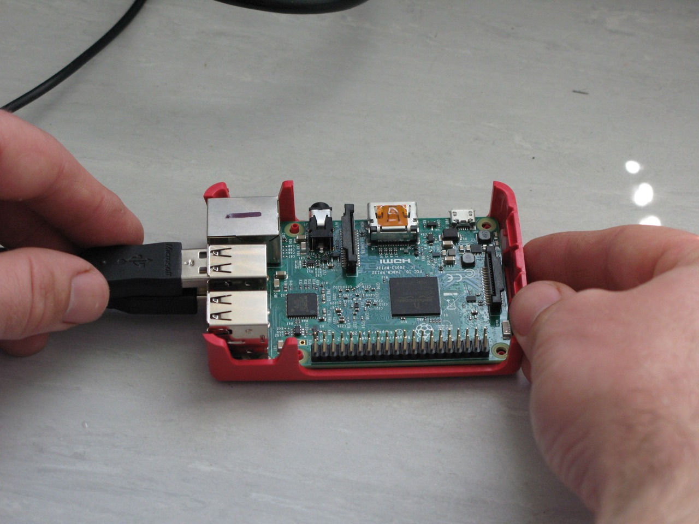

2. Insert the HDMI cable and connect to the monitor/TV using a HDMI to DVI-D adapter if required.

    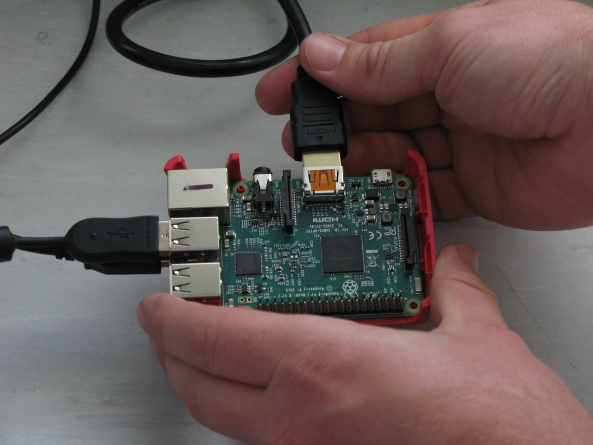

3. Connect the black jumper lead with the female connector from the switching circuit to a ground pin and the white jumpber lead to GPIO pin 4 (see below). See [GPIO: Raspberry Pi Models A and B](https://www.raspberrypi.org/documentation/usage/gpio/README.md) for more information about GPIO.

    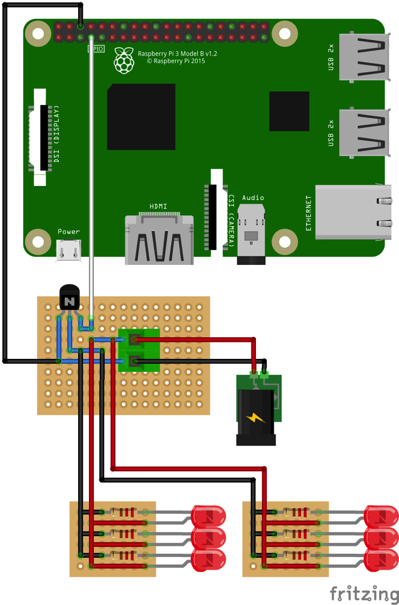
    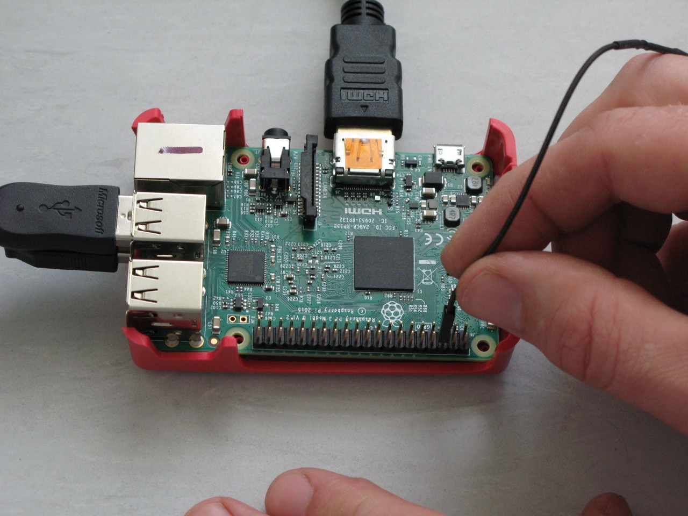    
    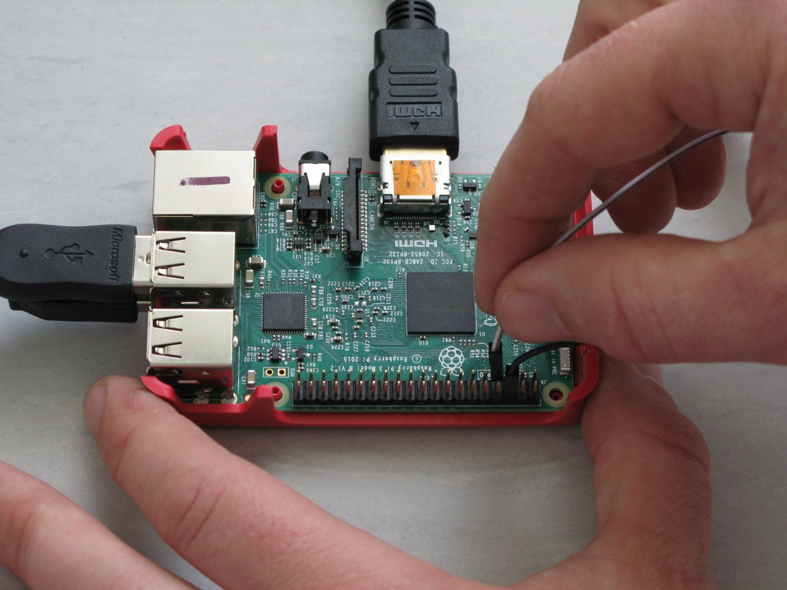    

4. Carefully attach the camera cable to the Pi and camera mounted on the clamp - see [Camera board setup](https://www.youtube.com/watch?v=GImeVqHQzsE) for video instructions for how to correctly attach the cable.

    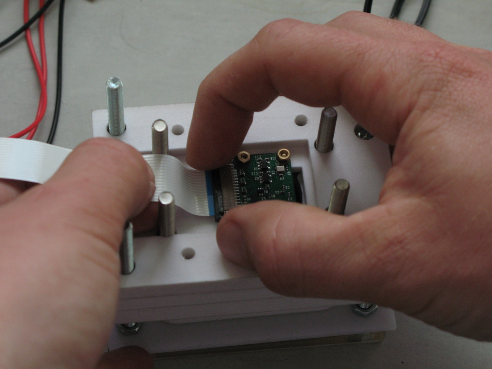    
    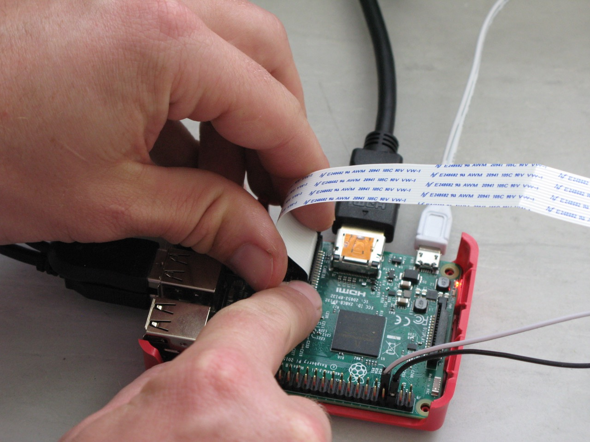    


5. Attach micro USB power cable. The Pi should turn on and start loading.

6. Connect a 12v supply to the switching circuit.

    There are a number of ways of connecting the 12v supply. If you followed the build instructions at [OpenSourceOV/clamp-build-instructions](https://github.com/OpenSourceOV/clamp-build-instructions.git) then you will have two wires coming out of the PCB mount screw block going to a male/female molex connector connected to another male/female connector with two more leads that are waiting to be connected to a 12v supply.

    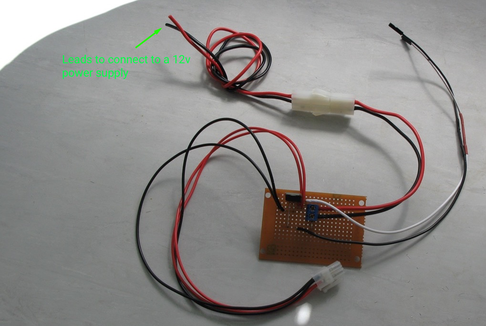    

    Some options for connecting to a 12v supply:

    * Strip insulation from the ends of the wires, attach [spade connectors](https://www.jaycar.com.au/9-5mm-female-spade-yellow-pk-4/p/PT4717),  and connect to the positive and negative terminals of a 12v battery such as [this one](https://www.amazon.com/ExpertPower-EXP1245-12V-Rechargeable-Battery/dp/B00A82A4N8/ref=sr_1_12_s_it?s=hpc&ie=UTF8&qid=1488243455&sr=1-12).
    * Use a [12v Wall Adapter Power Supply](https://www.sparkfun.com/products/9442) by removing the barrel connector on the adapter and joining the leads from the switching circuit (see [OpenSourceOV/clamp-build-instructions](https://github.com/OpenSourceOV/clamp-build-instructions.git) for instructions on joining and soldering wires). 
    * Strip insulation and connect to the terminals of a [desktop regulated power supply](https://www.jaycar.com.au/13-8v-20a-switchmode-bench-power-supply/p/MP3078).

7. At this point you should have a setup that looks like this. In this setup a 12v wall adapter has been used to power the switching circuit.

    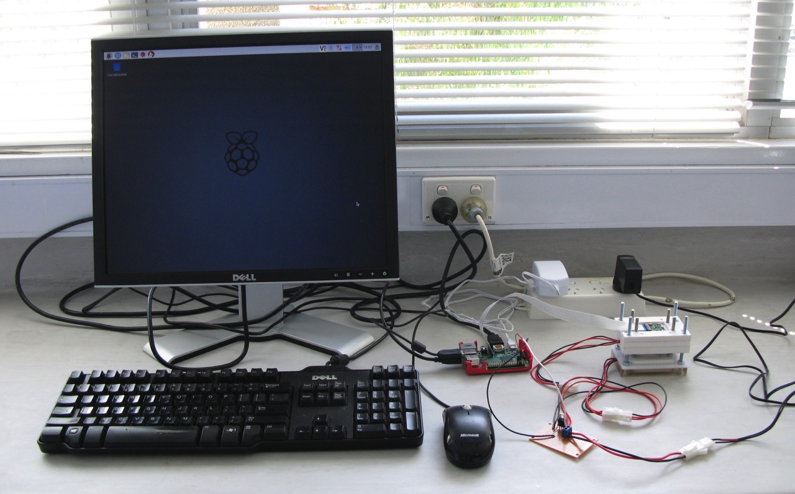

8. Insert the USB external hard drive or USB memory stick into a USB slot on  the Pi.

    (picture required)

### Image capture process

1. Set the date and time on Pi

    The Pi does not have an onboard power supply so it is unable to keep the correct time. Before initialising a capture procedure the date and time must be set so the timestamps of the image files are correct and can be married to measurements of water potential.

    From the terminal enter the command (substituting for the correct date/time):

    ```
    sudo date -s "Feb 22 2017 08:10"
    ```

2. Create a folder on the external hard drive or USB memory stick to store the captured images.

    From the terminal:

    ```
    cd /media/pi
    ls
    ```

    What you'll see now is a list of folders in the /media/pi folder. One of the folders will be 'Settings', the other will be the external hard drive or USB memory stick. Note the name of the folder and substitute for name-of-folder in the following command:

    ```
    cd name-of-folder
    ```
    e.g.
    ```
    cd TSB-USB02345
    ```

    If the folder name contains spaces e.g. 'TOSHIBA USB STICK' then you need to wrap it in quotes and escape the spaces using a back-slash:

    ```
    cd "TOSHIBA\ USB\ STICK"
    ```

    'cd' means 'change directory' i.e. move into the specified directory. Now we're 'in' the directory create a folder (using the mkdir command) and move into that directory:

    ```
    mkdir my-sample-22-02-2017
    cd my-sample-22-02-2017
    ```

3. Run the cavicapture script in setup mode.

    From the terminal:

    ```
    cavicapture.py --setup
    ```

    This will turn on the LED lights in the clamp and show a full screen camera preview.

    If the lights don't turn on or you get an error message see [Troubleshooting](./troubleshooting.md) for possible solutions.

4. Insert the sample between the spacer and the foot. It may be useful to apply tape to the edges of the sample to keep it fixed in position.

    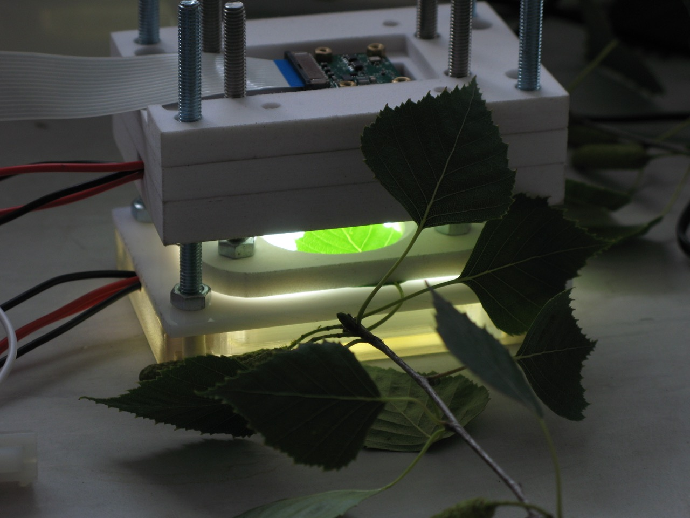

5. Your setup should now be looking something like this:

    

6. Adjust the focus by adjusting the four 5mm nuts on the spacer. This moves the sample further away or closer to the camera. Use something long and thin to adjust the nuts in situ rather than removing the spacer from the assembly and adjusting separately.

    (picture required)

7. Satisfied that the sample is in focus press Enter on the keyboard to exit the cavicapture setup mode.

8. Determine an optimimum shutterspeed for the camera

    The shutterspeed determines the amount of light captured by the camera and is measured in microseconds. Lower values = less light (dimmer image), higher values = more light (brigher image). Too dull and there will be more noise in the capture images, too bright and areas may be over-exposed. The LED lights are very bright to ensure there is less noise. Start with values around 1000 and adjust by 200 either way until the reaching the optimum shutterspeed.

    The shutterspeed is provided to the cavicapture script via the **--shutterspeed** option.

    Run the cavicapture script in setup mode, this time providing the shutterspeed as an additional option:

    ```
    cavicapture.py --setup --shutterspeed 1000
    ```

    The preview window will load applying the shutterspeed provided. Press Enter to exit the preview. Re-run the command with different shutterspeed values (pressing Enter to exit each time) until an optimum is reached:

    ```
    cavicapture.py --setup --shutterspeed 600
    cavicapture.py --setup --shutterspeed 1400
    ...
    ```

9. Cover the clamp and sample with light blocking material. Light from some LED computer monitors, TVs and strip lighting (fluorescent tubes) in particular will add considerable noise to the captured images. 

    (picture required)

10. Start capturing

    Now the cavicapture script is run with two additional options '--interval' and '--duration':

    * **--interval** sets the time between image captures, in seconds
    * **--duration** sets the total time for the capture sequence, in seconds
    
    For example, to capture an image every 5 minutes for 2 days:

    * 5 minutes x 60 seconds/minute = 300 seconds
    * 2 days = 48 hours * 60 minutes/hour * 60 seconds/minute = 172800 seconds

    Using these values we run the cavicapture script (without the --setup option):

    ```
    cavicapture.py --shutterspeed 800 --interval 300 --duration 172800
    ```

    The script will open a preview to check everything is OK. If not press CTRL-C to exit or adjust as required. Press Enter to start the capture process.


### Measuring plant water status

At regular intervals take measurements of the plant water potential by removing leaves and measuring using a scholander pressure chamber.

For more continuous and autonomous measurements use an [ICT Stem Psychrometer](http://www.ictinternational.com/products/psy1/psy1-stem-psychrometer/). When using a psychrometer attach the psychrometer to the stem **before** fixing the sample in the clamp.


